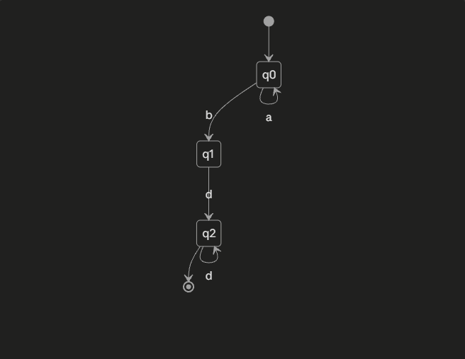

# Отчёт по лабораторной работе №1

Тема: Реализация конечного автомата для распознавания формальных языков

Вариант: 3 — язык `aⁿbdᵐ`, где n ≥ 0, m ≥ 1

## Постановка задачи

Разработать детерминированный конечный автомат (ДКА), распознающий слова вида: сколько-то символов `a` (можно ноль), затем ровно один `b`, затем один или более символов `d`.

## Диаграмма автомата



| Состояние | Описание |
|---|---|
| `q0` | начальное; читаем `a` (0 и более раз), ждём `b` |
| `q1` | `b` прочитан; не финальное — ждёт хотя бы один `d` |
| `q2` | финальное; прочитан хотя бы один `d` |
| `err` | ловушка — недопустимый символ или порядок символов |

## Реализация

Автомат задан таблицей переходов `(состояние, символ) -> состояние`. Функция `is_accepted(word)` проходит по слову посимвольно, на каждом шаге меняя текущее состояние согласно таблице; если переход не определён — слово сразу отклоняется. В конце слово считается допустимым, если итоговое состояние — `q2`.

```python
TRANSITIONS = {
    ('q0', 'a'): 'q0',
    ('q0', 'b'): 'q1',
    ('q1', 'd'): 'q2',
    ('q2', 'd'): 'q2',
}

def is_accepted(word):
    state = 'q0'
    for ch in word:
        state = TRANSITIONS.get((state, ch), 'err')
        if state == 'err':
            return False
    return state == 'q2'
```

## Верификация

Автомат проверен на 13 тестовых словах (5 допустимых и 8 недопустимых), включая граничные случаи (`bd` — минимальное слово, `''` — пустая строка) и типичные ошибки (посторонний символ, неверный порядок `b`/`d`, повтор `b`). Все тесты пройдены успешно, отклонений от ожидаемого результата не выявлено.


 `bd`  допустимо 
 `abd`  допустимо 
 `aabd`  допустимо 
 `bdd`  допустимо 
 `aaabddd`  допустимо 
 `''` (пусто)  недопустимо 
 `a`  недопустимо 
 `b`  недопустимо 
 `ab`  недопустимо 
 `bdb`  недопустимо 
 `aabdc`  недопустимо 
 `dabd`  недопустимо 
 `aaabbd`  недопустимо 

## Вывод

Реализованный автомат корректно распознаёт язык `aⁿbdᵐ` (n ≥ 0, m ≥ 1): все проверочные слова классифицированы верно, автомат детерминирован (для каждой пары состояние-символ определён не более одного перехода) и устойчив к некорректным входным данным.